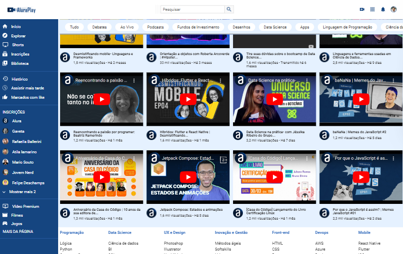
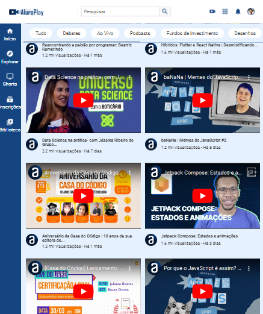

# AluraPlay

Seja bem vindo ao AluraPlay! 

Uma página focada para colocar os vídeos da [Alura](https://www.alura.com.br).

## Ferramentas usadas:

* HTML

* CSS

### Responsivo:

## Feito por:

### Maria Luíza, com o auxílio do professor Luan Alves no [curso](https://cursos.alura.com.br/course/css-flexbox-layouts-responsivos) da Alura.

### Linkedin: [Meu perfil!](https://www.linkedin.com/in/lizmariasena/)